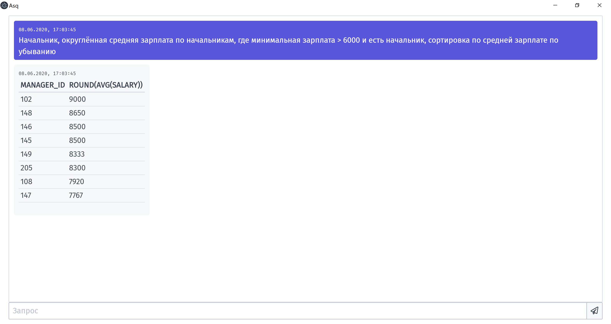

## About

This is my diploma project called Asq. It's an app that translates queries in Russian language into SQL queries.



The repository for the server can be found [here](https://github.com/Ruminat/Asq-Server).

The pdf document can be found [here](https://elib.spbstu.ru/dl/3/2020/vr/vr20-2586.pdf/info).

## Build Setup

``` bash
# install dependencies
npm install

# serve with hot reload at localhost:9080
npm run dev

# build electron application for production
npm run build

```
